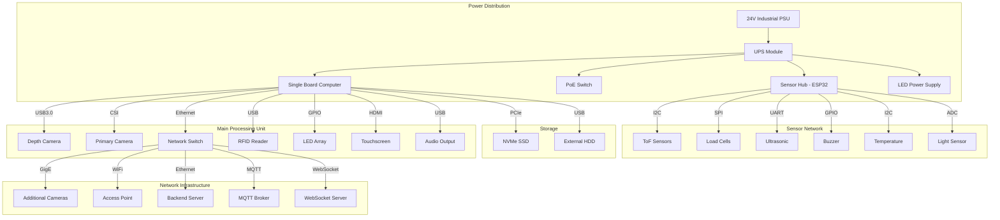

# SmartShelf AI Platform

  
  
  
  
  
  
  

## 📋 Table of Contents

- [Overview](#overview)
- [Features](#features)
- [System Architecture](#system-architecture)
- [Hardware Requirements](#hardware-requirements)
- [Software Stack](#software-stack)
- [AI & Computer Vision](#ai--computer-vision)
- [Installation Guide](#installation-guide)
- [API Documentation](#api-documentation)
- [Deployment Guide](#deployment-guide)
- [Monitoring & Observability](#monitoring--observability)
- [Security](#security)
- [Testing](#testing)
- [Contributing](#contributing)
- [License](#license)
- [Contact & Support](#contact--support)

---

## 🎯 Overview

**SmartShelf AI Platform** is a cutting-edge, end-to-end automated retail management solution that transforms traditional shelves into intelligent, self-aware inventory systems. Leveraging state-of-the-art computer vision and machine learning, it eliminates manual scanning and provides real-time inventory intelligence at scale.

### 🌟 Key Benefits

- **Zero Barcode Dependency** - Fully visual recognition of products
- **Real-Time Intelligence** - Instant detection of picks, returns, and anomalies
- **Scalable Architecture** - From single shelf to thousands of locations
- **Commercial Grade** - Production-ready with enterprise security
- **Cost Efficient** - Reduces shrinkage and optimizes restocking

### 🔥 Target Use Cases

- 🏪 **Retail Stores** - Smart shelves for supermarkets
- 📚 **Libraries** - Automated book tracking
- 🏥 **Hospitals** - Medical supply management
- 🔧 **Tool Shops** - Equipment tracking
- 💊 **Pharmacies** - Medicine inventory control
- 🏭 **Warehouses** - Smart bin management
- 🥫 **Vending Machines** - Automated restocking alerts

---

## ✨ Features

### Core Capabilities

| Feature | Description | Status |
|---------|-------------|--------|
| **Product Detection** | Real-time detection of all products using YOLOv11 | ✅ |
| **Product Recognition** | Identifies individual products without barcodes | ✅ |
| **Inventory Tracking** | Automatic count and stock level monitoring | ✅ |
| **Event Detection** | Pick, return, misplace, and restock events | ✅ |
| **Shelf Mapping** | Dynamic shelf slot and occupancy mapping | ✅ |
| **Analytics Engine** | Demand forecasting and anomaly detection | ✅ |
| **Real-time Alerts** | Instant notifications for critical events | ✅ |
| **Multi-Camera Support** | Synchronized multi-view monitoring | ✅ |

### Advanced AI Capabilities

- 🎯 **Object Detection** - YOLOv11, RT-DETR
- 🔍 **Instance Segmentation** - SAM2 for precise product boundaries
- 📍 **Object Tracking** - DeepSORT, ByteTrack, OCSORT
- 🧠 **Product Recognition** - Grounding DINO for zero-shot learning
- 📊 **Shelf Analysis** - Occupancy, mapping, and health monitoring

### Event Detection

- **🖐️ Product Picked** - Detects item removal
- **🔄 Product Returned** - Identifies item returns
- **⚠️ Misplaced Products** - Detects incorrect shelf placement
- **📦 Shelf Refilled** - Recognizes restocking events
- **🔴 Shelf Empty** - Alerts for depleted slots
- **❓ Unknown Products** - Flags unregistered items
- **💥 Product Falls** - Detects dropped items
- **📊 Multiple Products Removed** - Identifies bulk removal

---

## 🏗️ System Architecture

### High-Level Flow

---

## 🔧 Hardware Requirements

### Hardware Tiers

#### 🟢 Beginner/Development Version

| Component | Recommendation | Purpose |
|-----------|---------------|---------|
| **SBC** | Raspberry Pi 5 (8GB) | Main processor |
| **Camera** | Raspberry Pi Camera V3 | Primary vision |
| **Depth Camera** | Intel RealSense D415 | 3D mapping |
| **Display** | 5" Touchscreen | Local display |
| **Power** | 5V/5A USB-C | Power supply |
| **Storage** | 64GB microSD | OS & models |
| **Network** | WiFi/Bluetooth | Connectivity |
| **Sensors** | 2x HX711 Load Cells | Weight sensing |

**Estimated Cost:** $300-500

#### 🔵 Intermediate/Commercial Version

| Component | Recommendation | Purpose |
|-----------|---------------|---------|
| **SBC** | NVIDIA Jetson Orin Nano (8GB) | AI acceleration |
| **Camera** | Luxonis OAK-D | AI camera |
| **Depth Camera** | Intel RealSense D435 | Stereo vision |
| **Display** | 7" Capacitive Touchscreen | User interface |
| **Power** | Industrial 12V/5A PSU | Stable power |
| **Storage** | 128GB NVMe SSD | Fast storage |
| **Network** | Ethernet + WiFi 6 | Redundant network |
| **Sensors** | 8x Load Cells Array | Precision weighing |
| **RFID** | MFRC522 + Antenna | RFID backup |
| **LEDs** | WS2812B Strip | Status indicators |

**Estimated Cost:** $800-1,200

#### 🔴 Industrial Enterprise Version

| Component | Recommendation | Purpose |
|-----------|---------------|---------|
| **Main PC** | Industrial Fanless PC (i7) | Central processing |
| **AI Accelerator** | NVIDIA Jetson Orin AGX | Multi-model inference |
| **Cameras** | 4x PoE GigE Cameras | Multi-shelf coverage |
| **Depth Camera** | Intel RealSense L515 | LiDAR depth |
| **Display** | 15" Industrial Touch | Main dashboard |
| **Power** | 24V/15A Industrial PSU | Heavy duty |
| **UPS** | 1500VA UPS | Power backup |
| **Network** | Gigabit PoE Switch | Camera network |
| **Sensors** | 32x Load Cells Grid | Full shelf weighing |
| **RFID** | Impinj R700 | Enterprise RFID |
| **ToF** | VL53L5CX Array | Proximity sensing |

**Estimated Cost:** $3,000-5,000+

### Wiring Diagrams

#### System Integration Diagram

smartshelf/
├── backend/
│   ├── src/
│   │   ├── api/
│   │   │   ├── handlers/
│   │   │   │   ├── auth.rs
│   │   │   │   ├── inventory.rs
│   │   │   │   ├── products.rs
│   │   │   │   ├── analytics.rs
│   │   │   │   ├── events.rs
│   │   │   │   ├── devices.rs
│   │   │   │   └── system.rs
│   │   │   ├── routes/
│   │   │   │   ├── mod.rs
│   │   │   │   ├── api_v1.rs
│   │   │   │   └── websocket.rs
│   │   │   └── middleware/
│   │   │       ├── auth.rs
│   │   │       ├── logging.rs
│   │   │       ├── rate_limit.rs
│   │   │       └── cors.rs
│   │   ├── core/
│   │   │   ├── domain/
│   │   │   │   ├── entities/
│   │   │   │   │   ├── product.rs
│   │   │   │   │   ├── shelf.rs
│   │   │   │   │   ├── inventory.rs
│   │   │   │   │   ├── event.rs
│   │   │   │   │   └── user.rs
│   │   │   │   ├── value_objects/
│   │   │   │   │   ├── product_id.rs
│   │   │   │   │   ├── sku.rs
│   │   │   │   │   ├── quantity.rs
│   │   │   │   │   └── location.rs
│   │   │   │   └── aggregates/
│   │   │   │       ├── shelf_aggregate.rs
│   │   │   │       └── inventory_aggregate.rs
│   │   │   ├── usecases/
│   │   │   │   ├── inventory/
│   │   │   │   │   ├── track_product.rs
│   │   │   │   │   ├── update_stock.rs
│   │   │   │   │   └── sync_inventory.rs
│   │   │   │   ├── events/
│   │   │   │   │   ├── process_event.rs
│   │   │   │   │   ├── detect_anomaly.rs
│   │   │   │   │   └── generate_alert.rs
│   │   │   │   └── analytics/
│   │   │   │       ├── forecast_demand.rs
│   │   │   │       ├── generate_report.rs
│   │   │   │       └── analyze_patterns.rs
│   │   │   └── interfaces/
│   │   │       ├── repositories/
│   │   │       │   ├── product_repository.rs
│   │   │       │   ├── inventory_repository.rs
│   │   │       │   ├── event_repository.rs
│   │   │       │   └── user_repository.rs
│   │   │       └── services/
│   │   │           ├── ai_service.rs
│   │   │           ├── notification_service.rs
│   │   │           ├── mqtt_service.rs
│   │   │           └── cache_service.rs
│   │   ├── infrastructure/
│   │   │   ├── database/
│   │   │   │   ├── postgres/
│   │   │   │   │   ├── connection.rs
│   │   │   │   │   ├── repositories/
│   │   │   │   │   │   ├── product_repo.rs
│   │   │   │   │   │   ├── inventory_repo.rs
│   │   │   │   │   │   └── event_repo.rs
│   │   │   │   │   └── migrations/
│   │   │   │   │       ├── 20240101000000_create_tables.sql
│   │   │   │   │       └── 20240102000000_add_indexes.sql
│   │   │   │   └── redis/
│   │   │   │       ├── connection.rs
│   │   │   │       └── cache_service.rs
│   │   │   ├── mqtt/
│   │   │   │   ├── client.rs
│   │   │   │   ├── handler.rs
│   │   │   │   └── topics.rs
│   │   │   ├── ai/
│   │   │   │   ├── model_manager.rs
│   │   │   │   ├── inference.rs
│   │   │   │   └── training/
│   │   │   │       ├── pipeline.rs
│   │   │   │       └── evaluation.rs
│   │   │   └── external/
│   │   │       ├── email.rs
│   │   │       ├── sms.rs
│   │   │       └── webhooks.rs
│   │   ├── models/
│   │   │   ├── dto/
│   │   │   │   ├── request.rs
│   │   │   │   └── response.rs
│   │   │   └── schemas/
│   │   │       ├── product.rs
│   │   │       ├── inventory.rs
│   │   │       └── event.rs
│   │   ├── services/
│   │   │   ├── inventory_service.rs
│   │   │   ├── product_service.rs
│   │   │   ├── analytics_service.rs
│   │   │   ├── event_service.rs
│   │   │   ├── notification_service.rs
│   │   │   ├── device_service.rs
│   │   │   └── auth_service.rs
│   │   ├── utils/
│   │   │   ├── config.rs
│   │   │   ├── errors.rs
│   │   │   ├── logger.rs
│   │   │   ├── metrics.rs
│   │   │   └── validators.rs
│   │   └── main.rs
│   ├── migrations/
│   │   └── 20240101000000_initial.sql
│   ├── tests/
│   │   ├── integration/
│   │   │   ├── api_tests.rs
│   │   │   └── database_tests.rs
│   │   └── unit/
│   │       ├── models_tests.rs
│   │       └── services_tests.rs
│   ├── Cargo.toml
│   ├── Dockerfile
│   └── .env.example
├── frontend/
│   ├── src/
│   │   └── ... (see above)
│   ├── package.json
│   ├── Dockerfile
│   └── nginx.conf
├── edge/
│   ├── camera/
│   │   ├── camera_service.py
│   │   ├── calibration.py
│   │   └── capture.py
│   ├── vision/
│   │   ├── detector.py
│   │   ├── tracker.py
│   │   ├── segmenter.py
│   │   └── recognizer.py
│   └── firmware/
│       ├── esp32/
│       │   ├── sensor_hub.ino
│       │   ├── wifi_manager.ino
│       │   ├── mqtt_client.ino
│       │   └── ota_update.ino
│       └── requirements.txt
├── hardware/
│   ├── schematics/
│   │   ├── power_distribution.pdf
│   │   ├── sensor_hub.pdf
│   │   └── camera_mount.pdf
│   └── documentation/
│       ├── bill_of_materials.csv
│       └── assembly_guide.md
├── ml/
│   ├── training/
│   │   ├── detection/
│   │   │   ├── train.py
│   │   │   ├── config.yaml
│   │   │   └── dataset.yaml
│   │   ├── segmentation/
│   │   └── recognition/
│   ├── models/
│   │   ├── detection/
│   │   ├── segmentation/
│   │   └── recognition/
│   └── datasets/
│       ├── images/
│       ├── annotations/
│       └── metadata/
├── docs/
│   ├── api/
│   │   ├── openapi.yaml
│   │   └── README.md
│   ├── guides/
│   │   ├── installation.md
│   │   ├── deployment.md
│   │   ├── development.md
│   │   └── troubleshooting.md
│   ├── user/
│   │   ├── user_guide.md
│   │   └── admin_guide.md
│   └── hardware/
│       ├── assembly.md
│       └── maintenance.md
├── scripts/
│   ├── setup.sh
│   ├── deploy.sh
│   ├── backup.sh
│   └── test.sh
├── k8s/
│   ├── deployment.yaml
│   ├── service.yaml
│   ├── ingress.yaml
│   ├── configmap.yaml
│   └── secrets.yaml
├── docker-compose.yml
├── docker-compose.prod.yml
├── .github/
│   └── workflows/
│       ├── build.yml
│       ├── test.yml
│       └── deploy.yml
├── .gitignore
├── README.md
└── LICENSE
